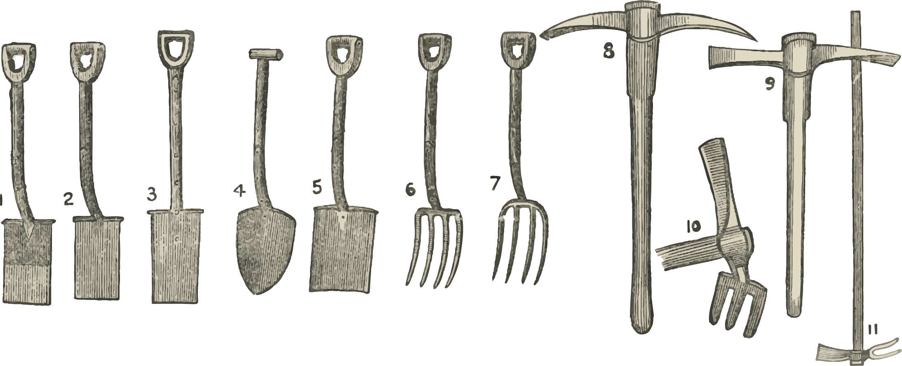

# Nuts and Bolts 

{width="90%"}

Here you can find important course documents and a list of tasks and activities for each week. Reach out to your student leader or course coordinator if you have specific questions!

## Syllabus
 
[<i class="far fa-file-code"></i> Click here to view the syllabus!](syllabus/196/syllabus.html)

Yes, the syllabus is full of a lot of boring information and rules, but we want to make sure you have everything you need to get the most out of BCQ.

<i class="fas fa-hand-point-right"></i> Strict Sally says, This document contains important policies about absences and late work! I love policies!

<iframe src="https://giphy.com/embed/XK8I8Am1gSe17MiJ2m" width="100%" height="100%" style="position:absolute" frameBorder="0" class="giphy-embed" allowFullScreen></iframe>

<a href="https://giphy.com/gifs/dave-chappelle-chappelles-show-XK8I8Am1gSe17MiJ2m">via GIPHY</a>

## What am I doing this week?

<i class="fas fa-users"></i> <i class="fas fa-arrow-right" style="opacity:0.5"></i> \ meeting as a class for a speaker or activity  
<i class="fa fa-suitcase"></i> \ <i class="fas fa-arrow-right" style="opacity:0.5"></i>  \ field trip with your student leader  
<i class="fa fa-check-square"></i> \ <i class="fas fa-arrow-right" style="opacity:0.5"></i>  \ extra credit opportunity in class  

Click on the assignment or study hall links to see what's happening that week. (Updated regularly!)

<table class="table" style="max-width:900px;margin-left:auto;margin-right:auto">
  <tr>
    <th style="width:23%;text-align:left">Week</th>
    <th style="width:35%">Description</th>
    <th style="width:10%;text-align:center">Activity</th>
    <th style="width:10%;text-align:center">Assignment</th>
    <th style="width:10%;text-align:center">Study Hall</th>
    <th style="width:12%;text-align:center">Extra Credit</th>
  </tr>

<tr>
<td align="left">(1) Aug 25/26</td>
<td align="center">welcome to BCQ!</td>

<td align="center"><i class="fas fa-users fa-lg"></i></td>
      
<td align="center">[<i class="far fa-copy fa-lg"></i>](https://uic.ca1.qualtrics.com/jfe/form/SV_3DHRRujJ9hIYmG2)</td>

<td align="center">[<i class="fas fa-user-graduate fa-lg">](#study-halls)</i></td>

<td align="center"><i class="fa fa-check-square fa-lg"></i></td>

</tr>
    
<tr>
<td align="left">(2) Sep 1/2</td>
<td align="center">getting to know the BCQ team</td>

<td align="center"><i class="fas fa-users fa-lg"></i></td>
      
<td align="center">[<i class="far fa-copy fa-lg"></i>](https://uic.ca1.qualtrics.com/jfe/form/SV_3DHRRujJ9hIYmG2)</td>

<td align="center"><i class="fas fa-user-graduate fa-lg" style="opacity:0.3"></i></td>

<td align="center"><i class="fa fa-check-square fa-lg"></i></td>

</tr>

<tr>
<td align="left">(3) Sep 8/9</td>
<td align="center">Dr. Andrew Hipp from Morton Arboretum</td>

<td align="center"><i class="fas fa-users fa-lg"></i></td>
          
<td align="center"><i class="far fa-copy fa-lg" style="opacity: 0.3;"></i></td>

<td align="center"><i class="fas fa-user-graduate fa-lg" style="opacity:0.3"></i></td>
    
<td align="center"><i class="fa fa-check-square fa-lg"></i></td>

</tr>

<tr>
<td align="left">(4) Sep 15/16</td>
<td align="center">group library field trip</td>
    
<td align="center"><i class="fa fa-suitcase fa-lg"></i></td>
              
<td align="center">[<i class="far fa-copy fa-lg"></i>](#speaker-reflections)</td>
        
<td align="center"><i class="fas fa-user-graduate fa-lg" style="opacity:0.3"></i></td>
        
<td align="center"><i class="fa fa-check-square fa-lg" style="opacity: 0.3;"></i></td>
    
</tr>

<tr>
<td align="left">(5) Sep 22/23</td>
<td align="center">Dr. Ankur Saxena from UIC Biological Sciences Department</td>

<td align="center"><i class="fas fa-users fa-lg"></i></td>
              
<td align="center">[<i class="far fa-copy fa-lg"></i>](#field-trip-journals)</td>
        
<td align="center"><i class="fas fa-user-graduate fa-lg" style="opacity:0.3"></i></td>
        
<td align="center"><i class="fa fa-check-square fa-lg"></i></td>
</tr>
    
<tr>
<td align="left">(6) Sep 29/30</td>
<td align="center">researchers from Biomedical Research Awareness Day</td>
            
<td align="center"><i class="fas fa-users fa-lg"></i></td>
                      
<td align="center">[<i class="far fa-copy fa-lg"></i>](#speaker-reflections)</td>
                
<td align="center"><i class="fas fa-user-graduate fa-lg" style="opacity:0.3"></i></td>
                
<td align="center"><i class="fa fa-check-square fa-lg" style="opacity: 0.3;"></i></td>
            
</tr>

<tr>
<td align="left">(7) Oct 6/7</td>
<td align="center">Benji Roberts, PhD candidate/Dr. Emily Minor from the UIC Biological Sciences Department</td>
    
<td align="center"><i class="fas fa-users fa-lg"></i></td>
                  
<td align="center">[<i class="far fa-copy fa-lg"></i>](#speaker-reflections)</td>
            
<td align="center"><i class="fas fa-user-graduate fa-lg" style="opacity:0.3"></i></td>
            
<td align="center"><i class="fa fa-check-square fa-lg"></i></td>
        
</tr>

<tr>
<td align="left">(8) Oct 13/14</td>
<td align="center">our second field trips</td>
                    
<td align="center"><i class="fa fa-suitcase fa-lg"></i></td>
                              
<td align="center">[<i class="far fa-copy fa-lg"></i>](#speaker-reflections)</td>
                        
<td align="center"><i class="fas fa-user-graduate fa-lg" style="opacity:0.3"></i></td>
                        
<td align="center"><i class="fa fa-check-square fa-lg" style="opacity: 0.3;"></i></td>
                    
</tr>  

<tr>
<td align="left">(9) Oct 20/21</td>
<td align="center">Dr. Lauren Allegretti from the UIC College of Dentistry</td>
            
<td align="center"><i class="fas fa-users fa-lg"></i></td>
                          
<td align="center">[<i class="far fa-copy fa-lg"></i>](#field-trip-journals)</td>
                    
<td align="center"><i class="fas fa-user-graduate fa-lg" style="opacity:0.3"></i></td>
                    
<td align="center"><i class="fa fa-check-square fa-lg"></i></td>
                
</tr>
        
<tr>
<td align="left">(10) Oct 27/28</td>
<td align="center">our third field trips ([student leader eval](#student-leader-evaluations) due)</td>
                            
<td align="center"><i class="fa fa-suitcase fa-lg"></i></td>
                                      
<td align="center">[<i class="far fa-copy fa-lg"></i>](#speaker-reflections)</td>
                                
<td align="center"><i class="fas fa-user-graduate fa-lg" style="opacity:0.3"></i></td>
                                
<td align="center"><i class="fa fa-check-square fa-lg" style="opacity: 0.3;"></i></td>
                            
</tr>
                          
<tr>
<td align="left">(11) Nov 3/4</td>
<td align="center">Lucy Delaney, Course Coordinator and former Forensic Molecular Biologist</td>
                
<td align="center"><i class="fas fa-users fa-lg"></i></td>
                              
<td align="center">[<i class="far fa-copy fa-lg"></i>](#field-trip-journals)</td>
                        
<td align="center"><i class="fas fa-user-graduate fa-lg" style="opacity:0.3"></i></td>
                        
<td align="center"><i class="fa fa-check-square fa-lg"></i></td>
                    
</tr>

<tr>
<td align="left">(12) Nov 10/11</td>
<td align="center">our fourth field trips</td>
                                    
<td align="center"><i class="fa fa-suitcase fa-lg"></i></td>
                                              
<td align="center">[<i class="far fa-copy fa-lg"></i>](#speaker-reflections)</td>
                                        
<td align="center"><i class="fas fa-user-graduate fa-lg" style="opacity:0.3"></i></td>
                                        
<td align="center"><i class="fa fa-check-square fa-lg" style="opacity: 0.3;"></i></td>
                                    
</tr>

<tr>
<td align="left">(13) Nov 17/18</td>
<td align="center">Dr. Rebecca Kreston, resident at UIC IM/EM Dual Training Program</td>
                    
<td align="center"><i class="fas fa-users fa-lg"></i></td>
                                  
<td align="center">[<i class="far fa-copy fa-lg"></i>](#field-trip-journals)</td>
                            
<td align="center"><i class="fas fa-user-graduate fa-lg" style="opacity:0.3"></i></td>
                            
<td align="center"><i class="fa fa-check-square fa-lg"></i></td>
                        
</tr>
          
<tr>
<td align="left">(14) Nov 24/25</td>
<td align="center">holiday</td>
                        
<td align="center"><i class="fas fa-drumstick-bite fa-lg" style="opacity:0.3"></i></td>
                                      
<td align="center"><i class="fas fa-leaf fa-lg" style="opacity:0.3"></i></td>
                                
<td align="center"><i class="fas fa-football-ball fa-lg" style="opacity:0.3"></i></td>
                                
<td align="center"><i class="fas fa-ice-cream fa-lg" style="opacity:0.3"></i></td>
                            
</tr>

<tr>
<td align="left">(15) Dec 1/2</td>
<td align="center">wrap-up and games ([student leader eval](#student-leader-evaluations) due)</td>
                        
<td align="center"><i class="fas fa-users fa-lg"></i></td>
                                      
<td align="center">[<i class="far fa-copy fa-lg"></i>](#speaker-reflections)</td>
                                
<td align="center"><i class="fas fa-user-graduate fa-lg" style="opacity:0.3"></i></td>
                                
<td align="center"><i class="fa fa-check-square fa-lg"></i></td>
                            
</tr>

<tr>
<td align="left">(16) December 8</td>
<td align="center">FiNaLs wEeK</td>
                            
<td align="center"><i class="fas fa-book-dead fa-lg" style="opacity:0.3"></i></td>        
                                          
<td align="center">[<i class="far fa-copy fa-lg"></i>](#final-reflection-paper)</td>

<td align="center"><i class="fas fa-user-graduate fa-lg" style="opacity:0.3"></i></td>
                                    
<td align="center"><i class="fas fa-book-dead fa-lg" style="opacity:0.3"></i></td>                         

</tr>

</table>

## How are grades determined?

We would be lying if we said that grades didn't matter at all. But it's important to remember that grades are simply a tool used by educators to track your progress in the course: they have no relevance to your value as a human being. We are here to serve you, regardless of how many points you earn in your classes. And, if you are struggling to keep up in this course or any other, do not hesitate to [reach out to Lucy](mailto:ldelan5@uic.edu). She loves to tell the story of how she got a D in Advanced Analytical Chemistry her senior year and barely graduated, and countless other stories where she struggled to keep up with work and school.

Anyway. The bulk of your grade will come from your weekly assignments. The rest is made up of participation points, student leader evaluations, your final reflection paper, and extra credit. See grade breakdown and cutoffs below.

<iframe src="https://giphy.com/embed/xT9IgEYXCNqPZnqMuY" width="100%" height="100%" style="position:absolute" frameBorder="0" class="giphy-embed" allowFullScreen></iframe>

<a href="https://giphy.com/gifs/studiosoriginals-xT9IgEYXCNqPZnqMuY">via GIPHY</a>

<table class="table" style="max-width:900px;margin-left:auto;margin-right:auto">
  <tr>
    <th>Item</th>
    <th>Points</th>
  </tr>
  
  <tr>
  <td>[welcome survey]()</td>
  <td>20 points</td>
  </tr>
  
  <tr>
  <td>[field trip journals](#field-trip-journals)</td>
  <td>20 points x 4 = 80 points</td>
  </tr>
  
  <tr>
  <td>[speaker reflections](#speaker-reflections)</td>
  <td>20 points x 7 = 140 points</td>
  </tr>
  
  <tr>
  <td>[class participation](#participation-and-extra-credit)</td>
  <td>5 points x 13 = 65 points</td>
  </tr>
  
  <tr>
  <td>[student leader evaluations](#student-leader-evaluations)</td>
  <td>10 points x 2 = 20 points</td>
  </tr>
  
  <tr>
  <td>[final reflection paper](#final-reflection-paper)</td>
  <td>45 points</td>
  </tr>
  
  <tr>
  <td></td>
  <td>**370 points**</td>
  </tr>
  
</table>

Find below the grade cutoffs for each letter grade. If you are curious about your current grade in the class, login to [Blackboard](https://uic.blackboard.com/ultra/institution-page) and view My Grades. We will do our best to make sure you have grades and comments for your assignments within one week of handing them in.

<table style="max-width:350px;margin-left:auto;margin-right:auto">
  <tr>
    <th>Grade</th>
    <th>Points (Percentage)</th>
  </tr>
  
  <tr>
  <td>A</td>
  <td>330 or higher (90% or higher)</td>
  </tr>

  <tr>
  <td>B</td>
  <td>296-329 (80-89%)</td>
  </tr>
  
  <tr>
  <td>C</td>
  <td>259-295 (70-79%)</td>
  </tr>

  <tr>
  <td>D</td>
  <td>221-258 (60-69%)</td>
  </tr>

  <tr>
  <td>F</td>
  <td>220 or lower (below 60%)</td>
  </tr>

</table>