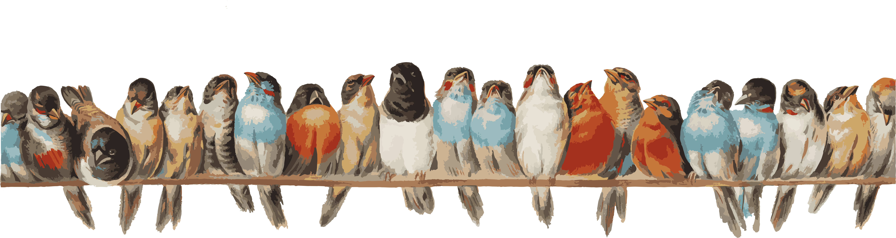

--- 
knit: "bookdown::render_book"
title: "BIOS 196 Biology Colloquium"
author: ""
date: "Fall 2021  Meets Wednesday or Thursday 2:00p-3:50p in SEL 4289"
description: "Website for all course materials related to Biology Colloquium, Fall 2021"
url: 'https\://ledelaney.org/teaching/bcq'
github-repo: "ledelaney/bcq"
cover-image: "images/birds.png"
site: bookdown::bookdown_site
---

# Welcome to Biology Colloquium!

{width="100%"}

This course is really a community: together, we will explore the various careers available to those who pursue a degree in biological sciences with a dope lineup of guest speakers and field trips. More importantly, we hope to make some new friends and have some fun. College isn't always easy, but this community should be a safe space where everyone feels comfortable discussing their hopes, dreams, and fears -- and the BCQ team will do everything we can to support you as you begin your academic journey.

<iframe src="https://giphy.com/embed/xUA7bcP3spz0M24IEw" width="100%" height="100%" style="position:absolute" frameBorder="0" class="giphy-embed" allowFullScreen></iframe>

<a href="https://giphy.com/gifs/schittscreek-funny-xUA7bcP3spz0M24IEw">via GIPHY</a>

This website is a living document that will contain the most up-to-date information on our various activities. Student leaders will be setting up GroupMes for their sections to let you know up-to-date announcements throughout the course. Stay tuned for more details. 

[[click here to download GroupMe](https://groupme.com/en-US/)]

**First order of business:** \ [[fill out the welcome survey](https://uic.ca1.qualtrics.com/jfe/form/SV_3DHRRujJ9hIYmG2)]  
This is important so we can put you in groups based on your unique interests!

The first 2-3 weeks of classes will be spent getting to know each other, building groups with student leaders, and finding out how the BCQ team can best serve you. After that, we will alternate each week between field trips (with your student leader and group), and guest speakers (everyone together).

## How do I use this website?

This website can be accessed from any device that is convenient for you. Use the buttons on the top navigation bar to open or close the navigation panel, search the website, or change the font and color to suit your preferences. (If you want to know more about how this website was created, and what GitHub even is, ask Lucy. She may pass out because she is so excited that you asked.) The website will grow and change as activities are added and the semester moves along.

<i class="fas fa-hand-point-right"></i> No one likes a Strict Sally, but every once and awhile she makes a good point. Find this symbol when Strict Sally says something important.

If you poke around on this website, you'll also find:

<table class="table" style="max-width:900px;margin-left:auto;margin-right:auto">
  <tr>
    <th></th>
    <th></th>
  </tr>
  
  <tr>
  <td><i class='fas fa-tools fa-lg'></i> \ [Nuts and Bolts](#nuts-and-bolts)</td>
  <td>Important course documents and weekly to-dos</td>
  </tr>
  
  <tr>
  <td><i class='far fa-copy fa-lg'></i> \ [Assignments](#assignments)</td>
  <td>How to complete and submit your weekly assignments</td>
  </tr>
  
  <tr>
  <td><i class='fas fa-bullhorn fa-lg'></i> \ [Speakers](#speakers)</td>
  <td>Updated regularly with information on speaker lineup</td>
  </tr>
  
  <tr>
  <td><i class='fas fa-suitcase fa-lg'></i> \ [Field Trips](#field-trips)</td>
  <td>Tidbits from field trips</td>
  </tr>
  
  <tr>
  <td><i class='fas fa-user-graduate fa-lg'></i> \ [Drop-In Hours](#drop-in-hours)</td>
  <td>Informal drop-in hours on various topics</td>
  </tr>
  
  <tr>
  <td><i class='far fa-folder-open fa-lg'></i> \ [Extras](#extras)</td>
  <td>Extra information and materials about the course</td>
  </tr>
  
  </table>

## Who is on the BCQ Team?

Our team includes student leaders, a course coordinator, and faculty advisors. During the first two weeks of the semester, you'll have an opportunity to get to know all the student leaders and your course coordinator -- and we will work to pair you with student leaders whose interests match yours. Your student leader is the one responsible for planning your field trips, grading most of your assignments, and keeping up with you all week-to-week, so make sure to give them extra elbow bumps for all their hard work.

<iframe src="https://giphy.com/embed/xjpFuSeXTnoBQOKLiQ" width="100%" height="100%" style="position:absolute" frameBorder="0" class="giphy-embed" allowFullScreen></iframe>

<a href="https://giphy.com/gifs/UOPX-high-five-uopx-university-of-phoenix-xjpFuSeXTnoBQOKLiQ">via GIPHY</a>

### Meet your student leaders

**Senior Student Leader (Thursday)**  

**Alyssa** (she/her) \ \ [<i class="far fa-envelope"></i> Email](mailto:aramos35@uic.edu)  
Alyssa is a 4th year biology major with a concentration in Molecular, Cellular, and Organismal Biology and an educational goal of pre-dentistry. She is part of the L\@S Ganas Research Fellowship and conducts research under Dr. Christina Nicholas at the College of Dentistry. Likes: food (PIZZA!), coffee, boba, amphibians, spooky season. Dislikes: chemistry, heat waves, styrofoam, burnt coffee. Aspirations: to open her own dental practice & mentor future pre-dental students.

**Wednesday Student Leaders**  

**Zahraa** (she/her) \ \ [<i class="far fa-envelope"></i> Email](mailto:zabbas9@uic.edu)  
Hello my name is Zahraa Abbas. I'm a last year student at UIC majoring in Biological sciences and Psychology and on the Pre-med track. My near future plan is to graduate college and go to med-school. I like helping people and I'm deeply interested in discovering and analyzing people's mindsets and their way of thinking. I'm a shopaholic and I use this habit as a coping mechanism! I also love spending quality time with friends and family. I love traveling and I'm very adventurous in life. I dislike the term impossible and my supreme goal is to be successful and effective as I always think that I was born to shine. 

**Leonardo (Leo)** \ \ [<i class="far fa-envelope"></i> Email](mailto:lcalde26@uic.edu)  
Leonardo is from the southwest side of Chicago. He is a second-year student pursuing a bachelor's degree in Biological Sciences with a minor in Kinesiology. He is currently on the pre-dental track. Likes: working out, nutrition, video games and anime. Dislikes: sleeping late/waking up early, unproductive days and stress. Aspirations: work in under-served communities and provide dental care to those without dental coverage, representation of Latinx into STEM and act as a role model to those in low-income areas. 

**Mohammed (Mo)** \ \ [<i class="far fa-envelope"></i> Email](mailto:mjalal4@uic.edu)  
Hello everyone, my name is Mohammed Jalal. I’m a senior majoring in Psychology on a pre-dental track. I got into dentistry because I want to shape the future of oral health care and raise awareness of oral hygiene. Likes: traveling, basketball, football, working out, cars, aviation and trying out new food. Dislikes: snow, winter, fall, Mondays, Sundays and most importantly protein shakes. Aspirations: build a community where people can come and feel welcomed.

**Natalie (Nat)** \ \ [<i class="far fa-envelope"></i> Email](mailto:npara2@uic.edu)  
Hi everyone! My name is Natalie and I'm a junior here at UIC. I’m a Biology Major on the Pre-Med track. I am a proud Polish American that grew up with 8 other crazy, wild siblings. I'm a very bubbly person whose energy seems to never empty. (It's all the coffee and Celsius I drink).  Likes: FOOD! I mean who doesn't! I really enjoy spending quality time with family and friends. HUGE adventure kinda girl who's also very competitive. Dislikes: I really dislike olives, and messes. Aspirations: Becoming a doctor and traveling the world.

**Yarah** \ \ [<i class="far fa-envelope"></i> Email](mailto:yquad2@uic.edu)  
Hi friends! My name is Yarah and I'm a junior majoring in biology following a pre-dental track. When I'm not studying, you'll catch me baking, biking, roller blading, or dental assisting at the endodontic and periodontic specialty office I work at. I took BCQ online both semesters of my sophomore year and am now looking forward to being in person as a student leader. I hope to provide you all with the same positive experience I had as a student in BCQ! Likes: shopping, reading, watching the sunrise, flowers, tacos, sushi. Dislikes: soda, long lines, technology. Aspirations: attend dental school! 

**Thursday Student Leaders**

**Hadeel** \ \ [<i class="far fa-envelope"></i> Email](mailto:habda2@uic.edu)  
Hello everyone! My name is Hadeel and I’m a junior at UIC currently studying biology. My dream in life is to become a Dentist and help those who are in need of oral care. My ethnic background is Palestinian and I am a first-generation American. Likes: turtles, traveling, cooking, memes. Dislikes: the effects of procrastinating (very normal), calculus, traffic, and stepping on a lego. Aspirations: To help each of you complete your goal and become the future that you want to be. I’m very excited to meet all of you this semester. See you soon :)

**Janet** \ \ [<i class="far fa-envelope"></i> Email](mailto:jcoron25@uic.edu)  
Hey guys! I am Janet. I am a second year student at UIC. I am majoring in Neuroscience on the pre-med track. I decided to minor in Spanish, French and Math. I love to be able to communicate and connect with people from other parts of the world and for some reason I love numbers. In my future I hope to find myself in an OR looking at someone's brain or if not then in an office giving patients help. Likes:running, eating either tacos or wings, and sleeping. Dislikes: cheese, winter, and disorganization. Aspirations: Have a good back-in person semester :)

**Godwin** \ \ [<i class="far fa-envelope"></i> Email](mailto:gsarpe2@uic.edu)  
Hello everyone! There was an elementary school boy who was always happy to hear the break bell so that he could go out and play soccer with friends. Now, turning in an assignment before 11:59 brings him so much joy. His name is Godwin. Likes: pineapple sundae on a hot summer day, Friday night movies (John Wick), studying in a quiet place and trying different meals. Dislikes: Reptiles (especially snakes), being unable to click skip on commercials and someone taking my leftover meal. Aspirations: Being able to share both college and life experiences as much as I can and make valuable lifelong friendships. 

### Meet your course coordinator

**Lucy** (she/her) \ \ [<i class="far fa-envelope"></i> Email](mailto:ldelan5@uic.edu) \ \ [<i class="fas fa-laptop"></i> Website](https://ledelaney.org)  
Lucy has been studying biology for 15 years, so she is very ancient but tries hard to be "hip." Once upon a time she was a Forensic Molecular Biologist at the NYC Medical Examiner's Office, but she gave up that life to study flowers and confuse her relatives. Likes: huevos rancheros, building IKEA furniture, waking up really early, and peonies. Dislikes: clutter, memes she does not understand, and bad formatting. Aspirations: helping undergraduates discover their superpowers. 

### Meet your faculty advisors

**Prof. Mike Muller** [<i class="far fa-envelope"></i> Email](mailto:mmuller@uic.edu) \ \ [<i class="fas fa-laptop"></i> Website](https://bios.uic.edu/profiles/muller-michael/)  
Hey everyone, my name is Mike and I'm a former Pizza Hut employee who decided that there was more to life than just pizza, so I went off to study plant paleontology.  I later decided that I would be better suited teaching than researching, so here I am.  Likes: flannel, Diet Coke, comic books, lucha libre, 70's music, and painting miniatures.  Dislikes: traffic, back pain, and seafood.  Aspirations: to get to know you all a little better and eat some more pizza.

**Dr. Karin Nelson** [<i class="far fa-envelope"></i> Email](mailto:knelsonn@uic.edu) \ \ [<i class="fas fa-laptop"></i> Website](https://bios.uic.edu/profiles/nelson-karin/)   

**Dr. Robie Mason-Gamer** [<i class="far fa-envelope"></i> Email](mailto:robie@uic.edu) \ \ [<i class="fas fa-laptop"></i> Website](https://bios.uic.edu/profiles/mason-gamer-roberta-j/)  

